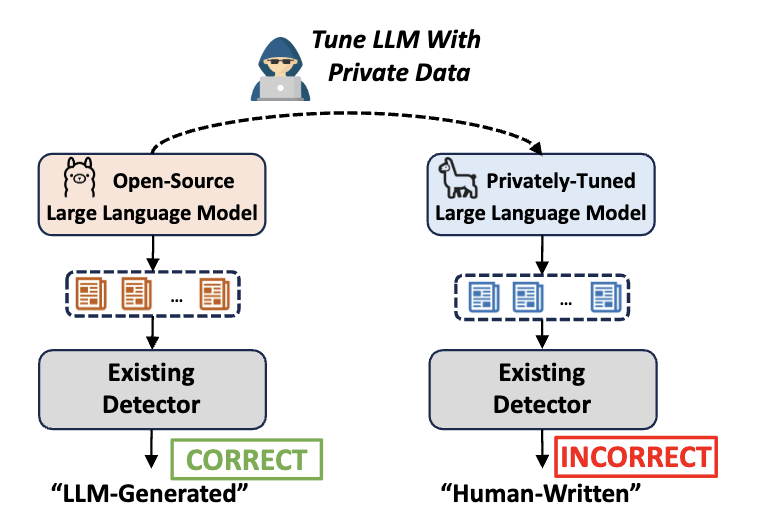
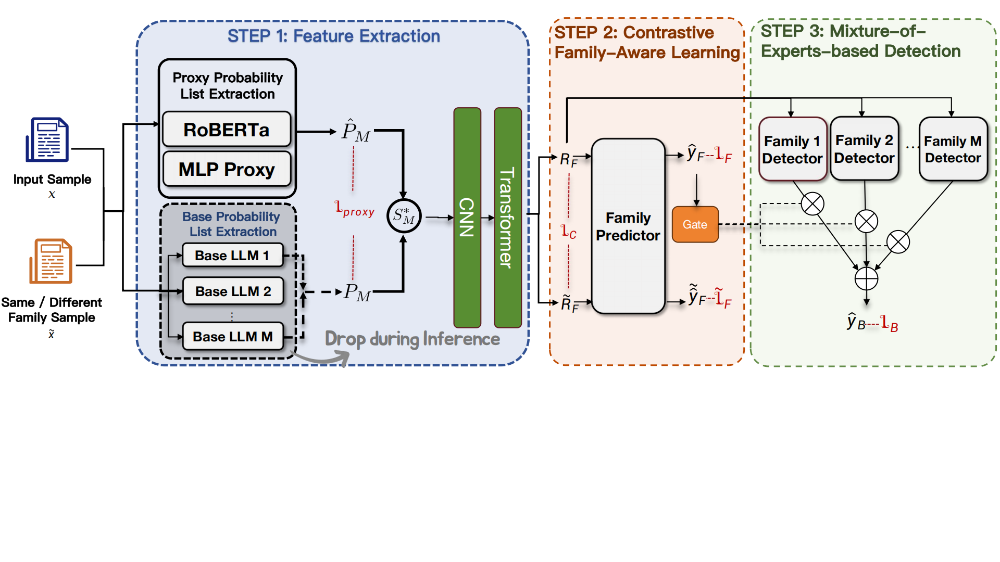

# PhantomHunter: AI-Generated Text Detection with Multi-Task MoE Framework

With the popularity of large language models (LLMs), undesirable societal problems like misinformation production and academic misconduct have been more severe, making LLM-generated text detection now of unprecedented importance. Though existing methods have made remarkable progress, they mostly consider publicly known LLMs when testing the performance and a new challenge brought by text from privately-tuned LLMs is largely underexplored.

Due to the rapid development of open-source models like the Qwen and LLaMA series, even ordinary users can now easily possess private LLMs by further tuning an open-source one with private corpora. This could lead to a significant performance drop of existing detectors by 41% at most in our preliminary study, due to their poor capability of capturing the essential LLM traits robust to fine-tuning operations.

To address this issue, we propose **PhantomHunter**, an LLM-generated text detector specialized for detecting text from unseen privately-tuned LLMs. Instead of memorizing individual characteristics, PhantomHunter's family-aware learning framework captures family-level traits shared across the base models and their derivatives.

Specifically, PhantomHunter first extracts base model features and distills them into a lightweight proxy module for deployment efficiency consideration, followed by a contrastive family-aware learning module that enhances the family-shared information. The enhanced features are then fed into a mixture-of-experts module containing multiple experts for corresponding families for final predictions. Experiments on data from four widely-adopted LLM families (LLaMA, Gemma, Mistral, and Qwen) show PhantomHunter's superiority over 9 baselines and 11 industrial services.

---
Here is the official implementation of "PhantomHunter: A Multi-Task Framework with Mixture of Experts for Generalized Generated Text Detection".


## Overview

<p align="center">
  
</p>

PhantomHunter is a unified framework for detecting AI-generated text that leverages Mixture of Experts (MoE) architecture, Contrastive Learning (CL), and Low-Rank Adaptation (LoRA) to achieve state-of-the-art performance across multiple AI model families.


## Architecture



**PhantomHunter** and the training process. Given a text sample $\mathbf{x}$, it **1)** extracts base probability lists from $M$ base LLMs and distills them into a lightweight RoBERTa-MLP proxy module, so the base LLMs can be dropped during inference; **2)** encodes the proxy probability features with CNN and Transformer blocks and applies contrastive family-aware learning to enhance family-shared information; and **3)** feeds the enhanced representation $\mathbf{R}_{F}$ to a mixture-of-experts network controlled by family gating weights for the final LLM-generated text prediction. The red terms are loss functions.

## Data
We simulate two common LLM usage scenarios: **writing** (69,297 arXiv paper abstracts) and **question-answering** (3,062 Q&A pairs from ELI5, finance, and medicine domains). We select four open-source models (LLaMA-2-7B-Chat, Gemma-7B-it, Mistral-7B-Instruct-v0.1, Qwen2.5-7B-Instruct) and fine-tune each with full-parameter and LoRA methods on domain-specific corpora, resulting in 48 derivative models for evaluation. 

```
Some test data can be available at ./data/
```

## Quick Start

### Installation
```
pip install -r requirements.txt
```

### Genfeature through four white-box model

1. loading models
```python
# cd ./genfeatures/
# you can modify you own model path in ./genfeatures/backend_api.py
python backend_api.py --port 6009 --timeout 30000 --debug --model=llama --gpu=0
python backend_api.py --port 6010 --timeout 30000 --debug --model=gemma --gpu=1
python backend_api.py --port 6011 --timeout 30000 --debug --model=mistral --gpu=2
python backend_api.py --port 6012 --timeout 30000 --debug --model=qwen2.5 --gpu=4
```
2. genfeatures
```python
# you should modify the en_input_files and en_outfiles path in ./genfeatures/gen_features.py
python ./genfeatures/gen_features.py --get_en_features_multithreading
```

### Train 
```bash
python main.py \
    --cuda  \
    --seed 2024 \
    --exp-name moe+logits+cl_arxiv-lora_5e-4 \
    --train-path /feature/arxiv_new/lora/train.jsonl \
    --val-path /feature//arxiv_new/lora/val.jsonl \
    --test-path /feature/arxiv_new/lora/test_ood.jsonl \
    --batch-size 64 \
    --lr 5e-4 \
    --train
```

### Train with Proxy MSE

The Proxy module learns to approximate the white-box probability features from
the encoder hidden states. During training, `--proxy-prob` controls how often the
model consumes proxy-generated features, while `--mse-weight` supervises the
proxy features against the original white-box probability features.

```bash
python main.py \
    --cuda \
    --seed 2024 \
    --exp-name moe+logits+cl+proxy_mse_arxiv-lora_5e-4 \
    --train-path /feature/arxiv_new/lora/train.jsonl \
    --val-path /feature//arxiv_new/lora/val.jsonl \
    --test-path /feature/arxiv_new/lora/test_ood.jsonl \
    --batch-size 64 \
    --lr 5e-4 \
    --is-cl \
    --proxy-prob 0.5 \
    --mse-weight 1.0 \
    --use-curriculum \
    --proxy-warmup-epochs 10 \
    --train
```

### Evaluation

```bash
python main.py \
    --cuda  \
    --seed 2024 \
    --exp-name moe+logits+cl_arxiv-lora_5e-4 \
    --train-path /feature/arxiv_new/lora/train.jsonl \
    --val-path /feature//arxiv_new/lora/val.jsonl \
    --test-path /feature/arxiv_new/lora/test_ood.jsonl \
    --batch-size 64 \
    --lr 5e-4 \
    --test
```

To evaluate with proxy-generated features instead of white-box probability
features, add `--use-proxy`:

```bash
python main.py \
    --cuda \
    --seed 2024 \
    --exp-name moe+logits+cl+proxy_mse_arxiv-lora_5e-4 \
    --test-path /feature/arxiv_new/lora/test_ood.jsonl \
    --batch-size 64 \
    --lr 5e-4 \
    --is-binary \
    --use-proxy \
    --test
```


## License

MIT License
